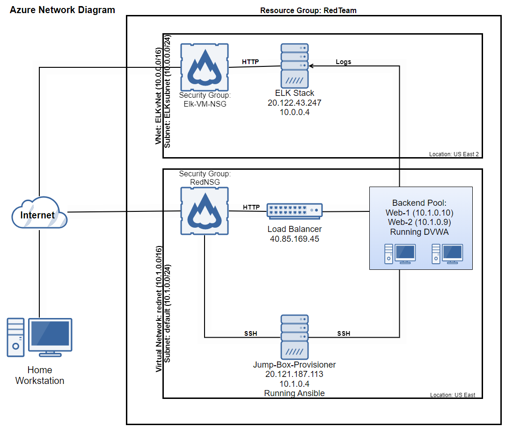

# Cybersecurity-Project-1

## Automated ELK Stack Deployment

The files in this repository were used to configure the network depicted below.

These files have been tested and used to generate a live ELK deployment on Azure. They can be used to either recreate the entire deployment pictured above. Alternatively, select portions of the _____ file may be used to install only certain pieces of it, such as Filebeat.

File: ansible_config.yml
---
- name: Configure VMs
  hosts: webservers
  become: true
  tasks:
    - name: docker.io
      apt:
        update_cache: yes
        name: docker.io
        state: present

    - name: Install pip3
      apt:
        name: python3-pip
        state: present

    - name: Install Docker python module
      pip:
        name: docker
        state: present

    - name: download and launch a docker web container
      docker_container:
        name: dvwa
        image: cyberxsecurity/dvwa
        state: started
        restart_policy: always
        published_ports: 80:80

    - name: Enable docker service
      systemd:
        name: docker
        enabled: yes

This document contains the following details:
- Description of the Topology
- Access Policies
- ELK Configuration
  - Beats in Use
  - Machines Being Monitored
- How to Use the Ansible Build

### Description of the Topology

The main purpose of this network is to expose a load-balanced and monitored instance of DVWA, the D*mn Vulnerable Web Application.

Load balancing ensures that the application will be highly reliable and accessible, in addition to restricting unauthorized access to the network.
- What aspect of security do load balancers protect? What is the advantage of a jump box?
	Load balancers route traffic to the optimal machine and ensure that neither machine will be overwhelmed while the other is idling. Should one machine go offline, the load balancer will route traffic to a server that is responding.
	The advantage of the jump box, a separate machine with access to the server, is that the administrator can access and manage the servers from a separate secure zone. The jump box is specifically hardened against attack through the use of SSH assymetric keys. 
	In this deployment, the jump box allows administrators with the correct SSH private key to access and modify the system. Thus, the public-facing HTTP site can implement rules preventing root access and secure those avenues of attack. Any unsecure administrative tasks on the public servers can be restricted, because there is a specialized jump box where those commands are permitted. 
	Since the jump box is only for executing administrative tasks, it can be further locked down by removing unnecessary software such as the GUI, and can close ports that would be required for traffic to the web server itself. This will also increase the resources available to the jump box. 

Integrating an ELK server allows users to easily monitor the vulnerable VMs for changes to the _____ and system _____.
- What does Filebeat watch for? 
	Filebeat is software used for log storage and monitoring. Filebeat will log the system log, use of sudo commands, SSH logins, and users/groups.
- What does Metricbeat record?
	Metricbeat is used for recording logs for the system's hardware performance. Typically, this will include CPU usage, memory usage, and storage disk space. 

The configuration details of each machine may be found below. [Markdown table created at http://www.tablesgenerator.com/markdown_tables]

| Name                 | Function      | IP Address                | Operating System   |
|----------------------|---------------|---------------------------|--------------------|
| Jump-Box-Provisioner | Admin Gateway | 10.1.0.4 (20.121.187.113) | Linux ubuntu 20.04 |
| Web-1                | Web Server    | 10.1.0.10 (40.85.169.45)  | Linux ubuntu 20.04 |
| Web-2                | Web Server    | 10.1.0.9 (40.85.169.45)   | Linux ubuntu 20.04 |
| ELK-VM               | ELK Stack     | 10.0.0.4 (20.122.43.247)  | Linux ubuntu 20.04 |

### Access Policies

The machines on the internal network are not exposed to the public Internet. 

Only the load balancer can accept connections from the Internet. Access to this machine is only allowed from the following IP addresses:
- 142.116.97.162

Machines within the network can only be accessed by the jump box.
- The ELK machine is accessible from my personal workstation (142.116.97.162)

A summary of the access policies in place can be found in the table below.

| Name                 | Publicly Accessible | Allowed IP Addresses |
|----------------------|---------------------|----------------------|
| Jump-Box-Provisioner | No                  | 142.116.97.162       |
| Web-1                | No                  | 10.1.0.4 10.0.0.4    |
| Web-2                | No                  | 10.1.0.4 10.0.0.4    |
| ELK-VM               | Yes                 | 142.116.97.162       |

### Elk Configuration

Ansible was used to automate configuration of the ELK machine. No configuration was performed manually, which is advantageous because...
-  The primary disadvantage to manual configuration is that it must be performed on each machine, every time reconfiguration is required. If this network had 2000 web machines instead of 2, this process would effectively prohibit configuration changes due to deployment time. By the time it is complete, the next configuration change might already be required. 
	The advantage of automating the configuration process is saving time by importing all configuration changes at once, instead of manually executing each task. By automating these simple tasks, firms do not have to hire excessive IT staff nor stop operations. 
	Furthermore, automated configuration ensures that each machine is absolutely identical. Manual configuration may result in various differences between each machine because human error may cause discrepencies should the administrator skip a step by accident or misclick in a menu. For example, when my brother registered for high school, the staff accidently set primary language to Edo instead of English. He repeatedly had to cope with the repurcussions of this mistake, and even received clarifying phone calls from university admissions years later. 

The playbook ansible_config.yml implements the following tasks:
- Install docker.io with Aptitude.
- Install pip3 python language with Aptitude.
- Install the Docker python module.
- Download the D*mn Vulnerable Web Application with Docker (image: cyberxsecurity/dvwa).
- Enable the Docker service with the system daemon.

The following screenshot displays the result of running `docker ps` after successfully configuring the ELK instance.

### Target Machines & Beats
This ELK server is configured to monitor the following machines:
- Web-1: 10.1.0.10
- Web-2: 10.1.0.9

We have installed the following Beats on these machines:
- Web-1: 10.1.0.10
- Web-2: 10.1.0.9

These Beats allow us to collect the following information from each machine:
- Filebeat: shipper for log data (specifically files under /var/log*.log path). Forwards log data to the ELK stack. 
- Metricbeat: collects system metric data, including CPU usage, memory stats, and storage disk space. This tracks the virtual machine's resources
- Both beats use kibana as a dashboard. output.elasticsearch specifies that the data will be forwarded to elasticsearch on the ELK stack.

### Using the Playbook
In order to use the playbook, you will need to have an Ansible control node already configured. Assuming you have such a control node provisioned: 

SSH into the control node and follow the steps below:
- Copy the ansible_config.yml file to /etc/ansible.
- Update the hosts file to include the IP addresses and python interpreter under the [webservers] group, and those of the ELK stack under a new group [elk]
- Run the playbook, and navigate to the webservers to check that the installation worked as expected.

Playbook FAQ:
- The playbook is ansible_playbook.yml. .yml files belong in the /etc/ansible directory
- Edit /etc/ansible/hosts to include IP address for each machine, or list the IPs under a [group]. The .yml playbook file must be edited to include the hosts: [group] line. The playbooks for the web VMs will state hosts: webservers while the playbooks for the ELK stack will state hosts: elk. webservers and elk are groups within the hosts file.
- In order to check that the ELK server is online, one must navigate to 20.122.43.247:5601/kibana/app in a web browser.

Playbook Installation
1. SSH into the jumpbox using your private key: ssh -i ssh.txt azadmin@20.124.17.143
2. Install Docker: sudo apt install docker.io . Download the container: sudo docker pull cyberxsecurity/ansible
3. List the available containers: sudo docker container list -a
4. Create the container from the image: sudo docker run <container name>
5. Start the container: sudo docker start <container name>
6. See running containers: sudo docker ps
7. Attach to the container shell: sudo docker attach <container name>. You should now be the root user of the ansible container. 
8. Edit /etc/ansible/ansible.cfg to include the admin name of the VMs. Edit /etc/ansible/hosts to include the private IP addresses of the VMs, and add "ansible_python_interpreter=/usr/bin/python3" after each IP address to specify the python3 script. 
9. Download the ansible configuration YML to /etc/ansible/: curl https://utoronto.bootcampcontent.com/utoronto-bootcamp/utor-virt-cyber-09-2021-u-lol/-/blob/master/1-Lesson-Plans/12-Cloud-Security/3/Activities/03_Ansible_Playbooks/Solved/ansible_config.yml
10. Download the ELK installation YML file to /etc/ansible/: curl https://utoronto.bootcampcontent.com/utoronto-bootcamp/utor-virt-cyber-09-2021-u-lol/-/blob/master/1-Lesson-Plans/13-Elk-Stack-Project/Activities/Stu_Day_1/Solved/Resources/install-elk.yml
11. Download the Filebeat configuration YML file to /etc/ansible/files/: curl https://gist.githubusercontent.com/slape/5cc350109583af6cbe577bbcc0710c93/raw/eca603b72586fbe148c11f9c87bf96a63cb25760/Filebeat > /etc/ansible/filebeat-config.yml
12. Edit the Filebeat YML to include the username and password under output.elasticsearch, and specify the IP address under output.elasticsearch and setup.kibana
13. Create the new playbook file /etc/ansible/roles/filebeat-playbook.yml and implement the following:
	a) Download the .deb file from artifacts.elastic.co. Install the package: dpkg -i filebeat-7.4.0-amd64.deb
	b) Copy the Filebeat configuration file to /etc/filebeat/filebeat.yml on the VM
	c) filebeat modules enable system, filebeat setup, service filebeat start, Enable the filebeat service on boot
14. Create the new playbook file for metric beat. Implement the following:
	a) Download the metricbeat .deb file. Install using dpkg
	b) Copy the updated metricbeat config file
	c) Run: metricbeat modules enable docker, metricbeat setup, metricbeat -e
15. Run all playbooks to install the web VMs, the ELK VM, filebeat, and metricbeat. 

